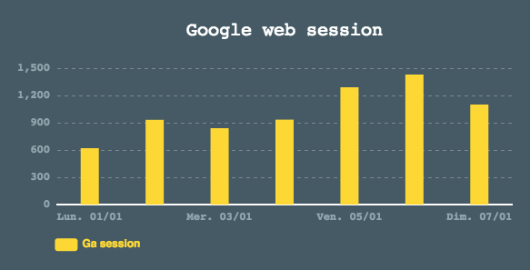

# ECharts

Le module ECharts est une bibliothèque graphique et de visualisation puissante offrant un moyen facile d'ajouter des graphiques intuitifs, interactifs et personnalisable à votre dashboard. 

Exemples :
 - Ajout d'un diagramme, camembert ...
 - Ajout d'une carte intéractive, graphes personnalisables ..
 - ...

## Base de configuration

Pour afficher un graphique, deux spécificités sont nécessaires : 
- Indiquer que votre grahique sois de type "**chart**".
- Préciser un composant : celui par défault est "**echarts**". 

Exemple : 
``` 
{
  "type": "chart"
  "charts": {
    "component": "nom_du_composant" 
  }
} 
```

## Graphiques préconfigurés

Il existe une dizaine de graphiques prêt à l'emploie. 
Remplacer simplement "**nom_du_composant**" de votre JSON par  **echarts** plus un composant présenté dans la liste ci-dessous. 
Par exemple : **echarts.area** 

Listes des grahiques préconfigurés :

| Composant | Exemple |
|--|--|
| area |  |
| areaspline |  |
| bar | |
| candlestick | |
| gauge | |
| line |  |
| pie |  |
| radar |  |
| tree | |

## Personnaliser vos graphiques 
Il est possible de personnaliser les graphiques à vos souhaits. 
Ajouter dans votre configuration l'object **"options"**.  Dans l'exemple, nous avons ajouté un **titre** à ce graphique.
Les options sont disponible à cette adresse :  *goo.gl/aZjDpP*

```
{
  "type": "chart"
  "charts": {
    "component": "nom_du_composant"
    "options: {
        "title": {
          "text": "..."
        }
    }
  }
} 
```
## Listes des options utiles

La documentation de Echarts est bien fournis et assez variée. Il existe quelques axes majeurs que vous pouvez changer afin de personnaliser vos grahpes.

| Nom | Description |
|--|--|
| grid | Grid représente le cadre de votre graphe |
| title | Title sera le titre du grid |
| tooltip | Tooltip, une fenêtre s'affiche avec les données du point |
| xAxis | Représente l'axe des abscisse |
| yAxis | Représente l'axe des ordonnées |
| series | Une série représente un ensemble de données associé a un nom |

